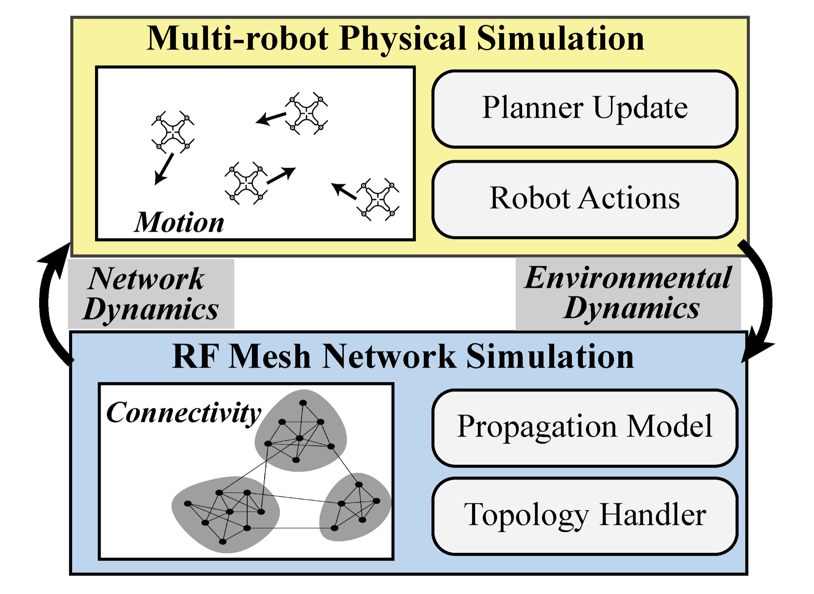
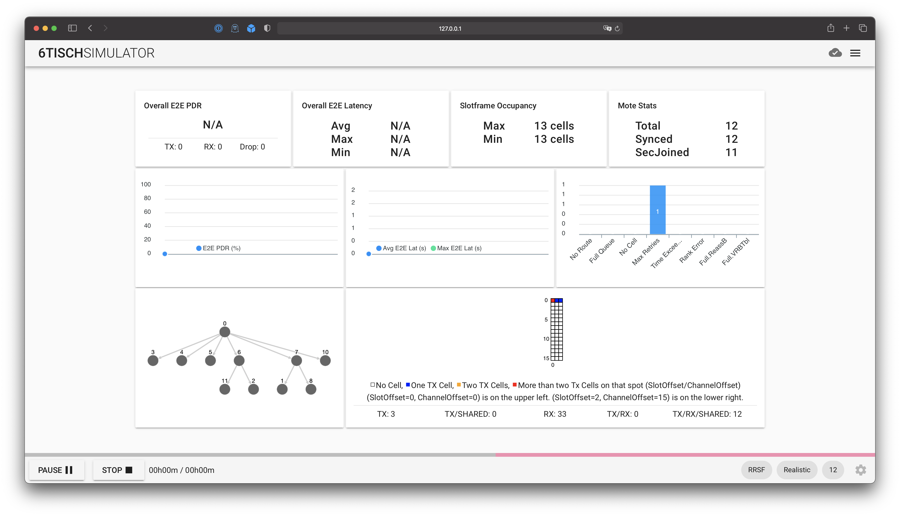
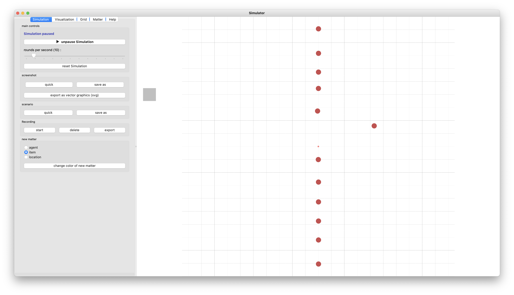

# BotNet: A Simulator for Studying the Effects of Accurate Communication Models on High-agent Count Multi-agent Control

​

​

Contents:
1. Setup and Background: [Github Link](https://github.com/PisterLab/BotNet/blob/main/README.md#setup-and-background) - [Local Link](./readme.md#setup-and-background)
2. Running BotNet and Experiments: [Github Link](https://github.com/PisterLab/BotNet/blob/main/README.md#running-botnet-and-experiments) -  [Local Link](./readme.md#running-botnet-and-experiments)
3. File Structure and Design Decisions: [Github Link](https://github.com/PisterLab/BotNet/blob/main/README.md#file-structure-and-design-decisions) -  [Local Link](./readme.md#file-structure-and-design-decisions)
​
----
## Setup and Background
In this section, we describe how one can get BotNet running and understand its motivation.
​
### Motivation
The goal of this simulator is to study how high agent-count multi-agent systems can be controlled. 

As agent counts increase, decentralized control becomes increasingly attractive due to its computational efficiency relative to centralized approaches.
A commonly unaddressed issue in the study of decentralized control, however, is the need for neighbors to identify eachother and communicate effectively, especially subject to the complex dynamics of an ad hoc RF mesh network.
This work pairs a high agent-count robot simulator with a full featured network simulator of a standards compliant RF mesh architecture, 6TiSCH.
Together, they form BotNet: an experimentation platform for understanding phenomena emerging from swarms attempting to maintain internal communication.
​
### Installation
This framework runs entirely on python and has very few requirements. The only setup required is installing the included conda environment.
```
conda env create -f environment.yml
```
Future work will integrate the simulator as a python package for integration with other projects.
​
### Core Building Blocks
​
We have built upon and paired two existing simulators. 
The first is the multi agent dyanmics simulator Swarm-Sim. 
Second is the the 6tisch simulator which simulates reliable, deterministic, and time sensitive networking.  
Together we believe these simulators provide an extensible framework to research multi agent control with realistic networking and to research networking in the context of changing multi agent systems. 

#### Swarm-Sim: Multi-agent Control and Swarm vs. Swarm Games
In this work we build off of [Swarm-Sim](https://gitlab.cs.uni-duesseldorf.de/cheraghi/swarm-sim): A 2D & 3D Simulation Core for Swarm Agents. Some notable changes have been made over the original version.
* Bugs were fixed causing the simulator to crash in routine operations.
* Adding a framework for continuous robotic control (discrete agent movements were default).
* More scenarios for studying multi-agent control
* Created a wrapper class for remote control of the simulator
* Added functionality to pass arguments into scenarios. 
Swarm-Sim comprises the dynamics simulation component of the dual-simulator. 
There are two primary places where experiments are defined on the Swarm-Sim side (environmental _scenarios_ and control _solutions_, see below). 
​
#### 6TiSCH Simulator: Standards Compliant IEEE802.15.4 Networking
For communications, we utilize 6TiSCH, a standards-compliant RF mesh networking protocol which is designed to be low-power, demand minimal computation overhead, and able to integrate with existing internet services. 
Together, these features make it well-suited for use in high agent- count, low-cost autonomous systems. 
6TiSCH combines Time Synchronized Channel Hopping (TSCH) with Internet Protocol version 6 (IPv6). 
Time Synchronized Channel Hopping (TSCH) changes when and which channels are used in wireless communications to provide more reliable communications.
The original simulator is found [here](https://bitbucket.org/6tisch/simulator/src/master/SimEngine/), and a review of 6TiSCH is found [here](url).
​
​
----
### Simulator Communication Architecture 
In joint simulation, botnet preserves each simulaters independence. The Swarm-Sim module of the simulator handles all multi agent control and simulation logic while the 6tisch module handles all networking logic. We have designed protocols for the two modules to communicate and synchronize states throughout simulation without compromising either simulator's indpendent simulation power. In this communication, first the networking simulator is initialized, and passes some initialization arguments to the robotics simulator such as random seed and number of motes. Once the robotics simulator has this information it initialize the robotics simulation and syncs the agent's states(positions) with the networking simulator. From there the networking simulator works to build the wireless network between motes. Once all motes have joined the network securely, the two simlators start handing control back and forth continuosly syncing states. For efficiency purposes we built 2 seperate architectures for this process. 

#### Dual Visualization
Both Swarm-Sim and 6Tisch support GUIs with real time visualizations of the experiment. 6tisch provides visualization capacities in the form of a web-app which is hosted on port 8080. Swarmsim provides visualizations by opening a PyOpenGL window. 
​
To handle quirks of the respective visualization modules we made use of an RPyC server to help the two simulators communicate. This server's API allows each proccess to send and recieve all information neccessary for the syncing of the two simulators. The RPC's purpose is to allow both simulators to communicate despite executing in separate processes.

#### No Vis
If you don't require visualization for your experiments it is not reccomended to use the RPyC server this will slow you down. Without the need to execute each simulation module in it's own process variables can be passed directly between them. To enable a faster simulation without visualizations we have build a wrapper class for Swarm-Sim defined in swarmsimmaster/commsenv.py. This class exposes the logic to run the main thread of swarm-sim for n iterations, set agent neighbors, query agent states etc. 


## Running BotNet and Experiments
#### Configurations
Experiment configurations are currently spread across two configuration files. 
`conf/swarmsim.yaml` corresponds to settings and configurations for the dynamics simulation module. 
`conf/6tisch.json` stores the settings and configurations for the networking simulator.  
Networking configurations stored in `6tisch.json` are also passed to the dynamics side of simulation upon initialization, however configurations from `swarmsim.yaml are` not passed to networking module (note: _this is not currently needed, but can be done if we need the dynamics to influence the network_). 
The motivation for this is to allow the dynamics side to take advantage of 6tisch's native support for iterating over combinations of parameters. 

##### 6tisch.json
`6tisch.json` details all of the settings for the 6tisch simulator. 
It is additionally easy to add new configurations. 
ll you have to do is add a field to the json and at runtime that field will be loaded as an attribute of the simengine's settings object.
The settings portion of 6tisch.json has two portions: combinations and regular. 
When simulating without visualizations the simulator will iterate over all combinations of parameters stored in the `combination` section of the settings json. For example if the combinations JSON is 
```
"combination": {
            "exec_numMotes":                               [10, 11, 12],

            "conn_class":                                  ["FullyMeshed", "FriisLower"]
}
```
then a total of 6 experiments will be run. 

Some important settings in 6tisch.json are listed below. 

`"exec_numMotes"` Is the number of motes used in the simulation. 
This is also passed to the robotics side of the simulator to populate the initial world conditions. 

`"conn_class"` tells 6tisch what network propogation model to use. 
These models are defined in 6tisch-simulator/SimEngine/Connectivity.py

`"sf_class"` is the scheduling function. 
Currently only two scheduling functions are supported. 
MSF (Minimum Scheduling Function, for more see [here](https://onlinelibrary.wiley.com/doi/pdf/10.1002/itl2.170)) and RRSF (Round Robin Scheduling Function, see more [here](https://en.wikipedia.org/wiki/Round-robin_scheduling)).

`"dual_vis"` tells 6tisch whether the simulator is being run with visualization enabled. 
If the used wants to vsualize the simulation the SimEngine needs to connect to and interact with the RPC server rather than directly with the swarmsim wrapper class. 


#### swarmsim.yaml

Swarmsim.yaml contains configurations red in by the swarmsim module of the simulator. Some if it's important settings are listed below:
`scenario`: Points to a file in the components/scenarios folder which should have a python function. This function will be called once upon initializing the swarmsim world. It effective sets up the 'scenario' our agents find themselves in. 

`solution`: Points to a file in components/solution which also should have a python function. This function is called on every timestep of simulation and is where control updates belong. 

`Visualization`: This tells swarmsim whether to run the GUI. It should be set to `0` for no visualization, `1` for visualizing just swarmsim and `2` for experiments where you are visualizing both swarmsim and 6tisch. 

`agent type`: This indicates which agent class the agents of the simulation are generated from. Choices currently include `1` for the VeloControlled agent class and `0` for the classic swarmsim agent. 

`run_network_propagation`: This is a boolean used when using high-agent counts (6TiSCH network formation fails) to control if a propagation model is used. When omitting the 6TiSCH simulator in this way, the entry `comms_model` sets the propagation model used.

### Running the experiment
We have provided two bash scripts to run experiments. One runs the experiments without visualization, while the other opens the simulator GUIs. Both swarmsim and 6tisch must be updated on whether or not you are expecting visualizations with the experiment and will break if run with the wrong command/settings combination. 

**To run an experiment with visualization set `dual_vis` to `true` in conf/6tisch.py and set `Visualization` to `2` in swarmsim.yaml**  

**To run an experminet without visualization set `dual_vis` to `false` in conf/6tisch.py and set `Visualization` to `0` in swarmsim.yaml**

We have included seperate bash scripts for running the code with and without visualization. To use it make sure the configurations detailed above are set correctly and enter the following in your terminal.  

`./botnet/scripts/run.sh` Will run the code without visualizations. 

`./botnet/scripts/dual_vis.sh` Will open the GUIs (Note:_ this will be substantially slower, so it is best to iterate with `run.sh` and then interpret select runs with visualization_). Visualization on logged data in under construction.


Example of the 6TiSCH Visualizer.

​
Example of the Environment Visualization.


### Running on Windows
Running on Windows may encounter other issues, particularly with syncrhonized visualization. 
We are finalizing supporting this platform.

​
### Logging
Basic data for experiments is logged in a directory `simData/` that is not tracked on git.
Additional logging can be performed by adding logic at the send of a solution.
​

### Common Problems
1. Due to the remote server architecture, sometimes subprocesses can hang. In case of failed initialization, look for running rpyc and multithreading objects with `ps`.
```
 ps | grep python
 kill pid
```
2. On the latest MacOS versions, OpenGL has a bug that affects the dynamics visualization. A fix is needed at the local Python version. See [this solution](https://stackoverflow.com/questions/63475461/unable-to-import-opengl-gl-in-python-on-macos).
​
----
## File Structure and Design Decisions
In this section we detail the structure of the simulator and what new users should know when designing new experiments.
​
### Core Components
​
To configure new robotic tasks and worlds, two key abstractions are used: **scenarios** and **solutions**.
By creating other classes akin to `VeloAgent`, other robotic dynamics can be encoded (see `swarmsimmaster/core/velo_controlled_agent.py`).
​

#### (Environment) Scenarios
A scenario is the initial conditions for a simulation. 
In these files, the world api is used to define the initial positions of all objects in the simulation and the environment. 
Scenarios are loaded from `swarmsimmaster/components/scenarios` at the beginning of the simulation. 
The current simulation to be loaded is defined in `conf/swarmsim.yaml`.
To create a scenario, utilize the world API in a Python script located in the scenarios folder. Examples of how to set up scenarios are in the scenarios folder. To run your scenario you must set the scenario argument at the bottom of config.ini to the name of your scenario file. Below is the simplest example of creating a lonely agent in the center of the world (which can be found [here](https://github.com/PisterLab/BotNet/blob/5af7fc809dea29e6e49b5275df13184c534b6518/gym-swarm-sim/envs/swarmsimmaster/components/scenario/configurable.py)).

​

```
def scenario(world):
  world.add_agent(world.grid.get_center())
```
For more details on the current scenarios, see the scenario description [readme](./swarmsimmaster/components/scenario/readme.md).
​

#### (Control) Solutions
The solution is where controls and dynamics are implemented. 
These use the world api to define the simulation behavior at every time step. 
The solution function is called on every iteration of SwarmSim's main loop. 
A solution is loaded from `swarmsimmaster/components/solutions`. 
At every step of the main loop the solution is executed. A solution file describes the controls of the agents and can optinally describe extra dynamics or interactions. 
Below is a solution which moves every agent in a random direction, which can be found [here](./swarmsimmaster/components/solution/random_walk.py). 
An example for a random walk controller is shown below.
```
def solution(world):
  if world.get_actual_round() % 1 == 0:
    for agent in world.get_agent_list():
      agent.move_to(random.choice(world.grid.get_directions_list()))
```
`conf/swarmsim.yaml` can be used to set all arguments for the simulation. These include which grid world to use, whether to use an agent with 0th, 1st, or 2nd order dynamics, how big the world is, etc. 
For more details on the current solutions, see the solution description [readme](./swarmsimmaster/components/solution/readme.md).
​

#### Agent Level Control
How to write controls at the agent level:
* In core, create a new python file with a class that inherits from `agent.py`.
* Define an instance method in this agent to describe control e.g. move(self).
* Pass the agent class in as the new_class parameter when adding the agent in the world
* Simply call the move function in the solution.

​
#### 6TiSCH Simulator
The 6TiSCH simulator can be seamlessly integrated to validate control performance with different local communications models. 
This tool can also be used by networking researchers to add more complex schedule functions and network behavior.
​
