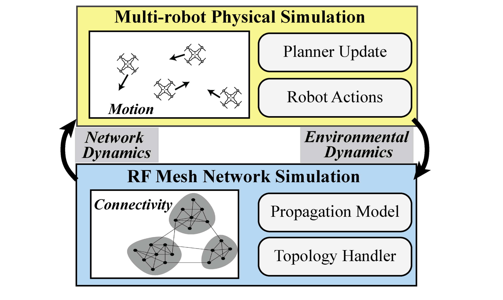

# BotNet: A Simulator for Studying the Effects of Accurate Communication Models on High-agent Count Multi-agent Control



Contents:
1. [Setup and Background](./readme.md#setup-and-background)
2. [Running BotNet and Experiments](./readme.md#running-botnet-and-experiments)
3. [File Structure and Design Decisions](./readme.md#file-structure-and-design-decisions)

----
## Setup and Background
In this section, we describe how one can get BotNet running and understand its motivation.

### Motivation
The goal of this simulator is to study how high agent-count multi-agent systems can be controlled. 
As agent counts increase, decentralized control is a popular solution to control many agents because it becomes more computationally efficient.
Though, a commonly unaddressed issue in decentralized control is the need for neighbors to identify eachother and communicate effectly. 
This work pairs the high agent-count simulator with a standards compliant (important for sim2real) network simulator: 6TiSCH.
Together, BotNet is an experimentation platform for understanding phenomena emerging from swarms attempting to maintain internal communication.

### Installation
This framework runs entirely on python and has very few requirements. The only setup required is installing the included conda environment.
```
<set up your own virtualenv with conda or whatever>
pip install -r requirements.txt
cd swarmsimmaster/
```
Future work will integrate the simulator as a python package for integration with other projects.

### Core Building Blocks

#### SwarmSim: Multi-agent Control and Swarm vs. Swarm Games
In this work we build off of [Swarm-Sim](https://gitlab.cs.uni-duesseldorf.de/cheraghi/swarm-sim): A 2D & 3D Simulation Core for Swarm Agents. Some notable changes have been made over the original version.
* Bugs were fixed causing the simulator to crash in routine operations.
* Adding a framework for continuous robotic control (discrete agent movements were default).
* More scenarios for studying multi-agent control
* Created a wrapper class for remote control of the simulator
* Added functionality to pass arguments into scenarios. 

Swarm-Sim comprosises the dynamics simulation componenet of the dual-simulator. 
There are two primary places where experiments are defined on the Swarm-Sim side. 

#### 6TiSCH Simulator: Standards Compliant IEEE802.15.4 Networking
_TODO_


----
## Running BotNet and Experiments
to run the dual visualization, first (in the top level directory): python dual_vis_messenger_server.py  then (in seperate terminals). 6tisch/gui/backend/start and (in the swarmsimmaster folder) python3 swarmsim.py

We have set uo two frameworks to enable communications between the 6tisch-simulater and Swarm-Sim Simulator. 
### No Vis 
To enable fast simulation without visualization we have created a wrapper class for Swarm-Sim defined in swarmsimmaster/commsenv.py. This allows the Swarmsim simulator to be remotely controlled doing things such as setting agent velocities, setting mote neighbors, getting mote states and executing a timestep of Swarm-Sim dynamics simulation. Through this interface the 6tisch-simulator synchrozises with the robotics simulator and provides it with the neccessary information to simulate the control algorithms. 

We have included a bash script for running the code. To use it, enter the following in your terminal.
```
./run.sh
```
Example of the 6TiSCH Visualizer.


Example of the Environment Visualization.


### With visualization
We have also built a framework for using both the Swarm-Sim GUI and the 6tisch GUI at the same time. 6tisch provides visualization capacities in the form of a web-app which is hosted on port 8080. Swarmsim provides visualizations by opening a PyOpenGL window. 

To handle certain quirks of the respective visualization modules we implenented a interface server which allows the two simulators to communicate despite executing in seperate processes. Running a simulation with dual visualizations is a little bit more complicated because first the interface server must be started followed by the 6tisch GUI server and finally swarmsim. This can all be run via 
```
./dual_vis.sh
```
However, to run this, both simulators must be alerted of these settings. SwarmSim can be alerted by setting Visualization to 2 in config.ini. 6tisch can be alerted with the rpc variable. 

Once the windows are open the play button in the 6tisch Gui must be pressed to start the networking simultion. Dynamics simulation won't start until the 6tisch network is fully formed, but in order to start the Swarm-Sim side of the simulation the 'start simulation' button must be pressed in the Swarm-Sim Gui

### BotNet RPC server:
To start the rpc server cd into the swarmsimmaster directory and run `python3 rpyc_server.py`. 
Once the server is started you can connect to the via the following python code in any directory  
`import rpyc`  
`service = rpyc.connect("localhost", 18861).root`  
This will let you remotely control the simulator via the service variable.

### SwarmSim Interface
`python swarmsim.py`

`python ../../../6tisch-simulator/bin/runSim.py`


### Visualizing both Simulators

Both simulators can be visualized live in the same experiment. To do this 
1. Set the Swarm Sim scenario to dual_vis_tisch
2. Set the Swarm sim solution to tisch_visualization
3. run dual_visualization.sh

### Experiment Examples

#### Flocking

#### Formation Control

### Logging
Basic data for experiments is logged in a directory `simData/` that is not tracked on git.
Additional logging can be done by adding logic at the send of a solution.

### Common Problems
Due to the remote server architecture, sometimes subprocesses can hang. In case of failed initialization, look for running rpyc and multithreading objects with `ps`.
```
 ps | grep python
 kill pid
```

----
## File Structure and Design Decisions
In this section we detail the structure of the simulator and what new users should know when designing new experiments.

### Intermediate Server Architecture
TODO describe how rpyc works.

### Core Components

To configure new robotic tasks and worlds, two key abstractions are used: **scenarios** and **solutions**.
By creating other classes akin to `VeloAgent`, other robotic dynamics can be encoded (see `swarmsimmaster/core/velo_controlled_agent.py`).

#### (Environment) Scenarios
A scenario is the initial conditions for a simulation. 
In these files, the world api is used to define the initial positions of all objects in the simulation and the environment. 
Scenarios are loaded from `swarmsimmaster/components/scenarios` at the beggining of the simulation. 
The current simulation to be loaded is defined in `conf/swarmsim.yaml`.
To create a scenario utilize the world API in a Python script located in the scenarios folder. Examples of how to set up scenarios are in the scenarios folder. To run your scenario you must set the scenario argument at the bottom of config.ini to the name of your scenario file. Below is the simplest  example of creating a lonely agent in the center of the world (which can be found [here](https://github.com/PisterLab/BotNet/blob/5af7fc809dea29e6e49b5275df13184c534b6518/gym-swarm-sim/envs/swarmsimmaster/components/scenario/configurable.py)).

```
def scenario(world):
  world.add_agent(world.grid.get_center())
```
For more details on the current scenarios, see the scenario description [readme](./swarmsimmaster/components/scenario/readme.md).

#### (Control) Solutions
The solution is where controls and dynamics are implemented. 
These use utilize the world api to define the simulation behavior at every time step. 
The solution function is called on every iteration of SwarmSim's main loop. 
A scenario a solution is loaded from `swarmsimmaster/components/solutions`. 
At every step of the main loop the solution is executed. A solution file describes both the controls of the agents and can describe extra dynamics or interactions. 
Below is a solution which moves every agent in a random direction, which can be found [here](./swarmsimmaster/components/solution/random_walk.py). 
An example for a random walk controller is shown below.
```
def solution(world):
  if world.get_actual_round() % 1 == 0:
    for agent in world.get_agent_list():
      agent.move_to(random.choice(world.grid.get_directions_list()))
```
`conf/swarmsim.yaml` can be used to set all arguments for the simulation. These include which grid world to use. 
Whether to use an agent with 0th 1st or 2nd order dynamics, how big the world is, etc. 
For more details on the current scenarios, see the scenario description [readme](./swarmsimmaster/components/solution/readme.md).

#### Agent Level Control
How to write controls at the agent level:
* In core, create a new python file with a class that inherits from `agent.py`.
* Define an instance method in this agent to describe control eg. move(self).
* Pass the agent class in as the new_class parameter when adding the agent in the world
* Simply call the move function in the solution.

#### 6TiSCH Simulator
The 6TiSCH simulator can be seamlessly integrated to validate control performance with different local communications models. 
This tool can also be used by networking researchers to add more complex schedule functions and network behavior.

----

## Citation
To cite this work, please use the following (_we can upload to arxiv so everything is good to go_):
```
@article{botnet2021,
  Title = {BotNet: A Simulator for Studying the Effects of Accurate Communication Models on High-agent Count Multi-agent Control},
  Author = {Felipe Campos, Nathan Lambert, Mark Selden, Jason Zhou, Daniel Drew, Kristofer S. J. Pister},
  journal={To Appear},
  year={2021}
}
```
